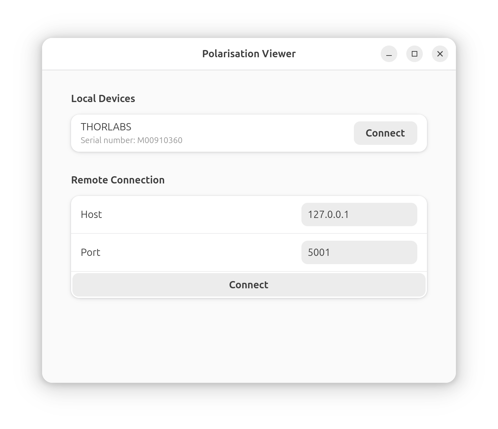

# Polarimeter

Control Thorlabs polarimeters with a GUI. Supports both locally connected devices and remote devices with an included server script.

# Setup
`python3 -m venv .venv`\
`source .venv/bin/activate`\
`pip install -r requirements.txt`

# Server
`python3 -m polarimeter.remote_server`

# GUI
## Linux (Tested on Ubuntu 22.04 Jammy Jellyfish)
Use `--system-site-packages` method if you want to allow the python environment to access the system's `pygobject` for GTK and Adwaita libraries to avoid having to compile `pygobject` as PyPI only hosts the source for this module

### Using the system pygobject (avoids compiling)
`sudo apt install python3-venv`\
`python3 -m venv .venv --system-site-packages`\
`source .venv/bin/activate`\
`pip install -r requirements.txt`\

### Using venv pygobject
`sudo apt install python3-venv build-essential libcairo2-dev python3-dev libgirepository1.0-dev` (can use `libgirepository-2.0-dev` on Ubuntu 24.04 and later)\
`python3 -m venv .venv`\
`source .venv/bin/activate`\
`pip install -r requirements.txt pygobject==3.50.1` (can use newer `pygobject` on Ubuntu 24.04 and later)

## MacOS (Tested on macOS 15.5 Sequoia)
Installing the dependencies using homebrew also installs Python 3.13. Apple's command line developer tools installs Python 3.9, which is too old. This was tested using the homebrew Python version

`brew install gobject-introspection libadwaita`\
`python3 -m venv .venv`\
`source .venv/bin/activate`\
`pip install -r requirements.txt pygobject`

## Windows
### Using MSYS2
`pacman -S mingw-w64-ucrt-x86_64-libadwaita mingw-w64-ucrt-x86_64-python3-gobject mingw-w64-ucrt-x86_64-python3-matplotlib`

## Usage
`python3 -m polarimeter.gui` for local polarimeter